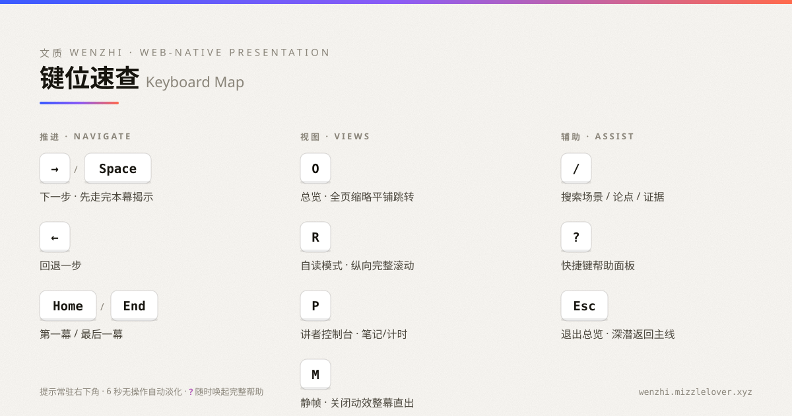

# 文质 Wenzhi · Web-native Presentation Intelligence
# 文质 · HTML 原生智能演示系统

> 「质胜文则野，文胜质则史。文质彬彬，然后君子。」——《论语 · 雍也》
>
> 品牌释义：**质** = 内容、论证、策略（Strategy → IR 管线）；**文** = 渲染、视觉、呈现（Renderer）。AI 演示的常见失败是"文胜质"——形式压过内容。「文质」先把"质"立住，再让"文"恰如其分。

> 不是又一个 PPT 模板生成器——而是一套把**演示科学**（认知科学 / 传播学 / 演示研究）与 **Web 演示工程**打通的 AI Skill。给定复杂内容、真实受众、沟通目标与场景，它产出的不是"幻灯片文件"，而是一个可现场运行、可分支深潜、可动态调整的 **Presentation Application（演示应用）**。
>
> Not another slide-template generator — an AI Skill that fuses **presentation science** (cognitive science, communication, presentation research) with **web presentation engineering**. Given complex content, a real audience, a communication goal and a situation, it produces not "slide files" but a runnable, branchable, adaptive **Presentation Application**.

**官网 / Website**：https://present.mizzlelover.xyz · **在线 Demo / Live Demo**：https://present.mizzlelover.xyz/examples/demo/（本地运行：`examples/demo/index.html`）

---

## 它解决什么 · What it solves

| 常见工具 | 本系统 |
|---|---|
| 输入 → 直接生成 HTML 页面 | 输入 → **演示策略 → 论证架构 → Scene 规划 → Presentation IR → 渲染 → QA**（禁止一步到位） |
| 通用规则："每页 6 行""标题必须问句" | **证据分级（A–E）+ 边界条件**：规则必须带机制、语境、证据、例外 |
| 线性翻页器 | **Presentation Graph**：核心路径 / 可选路径 / Deep Dive / 证据附录 / 现场分支 |
| 只有"放映"一种形态 | **One Content Model, 三种 Mode**：Stage（讲演）/ Reader（自读）/ Print（打印） |
| 动画=装饰 | **语义动效**（REVEAL/FOCUS/CAUSE…），讲者可 pause/seek/skip |
| 依赖 CDN、现场断网即崩 | **离线优先**：整目录打包，Stable > Fancy |

## 快速开始 · Quick Start

```bash
# 1. 安装到你的 AI 编程环境（Claude Code / Codex / OpenCode / Kimi Code）
cp -r web-presentation-skill ~/.config/agents/skills/     # 用户级
# 或项目级：cp -r web-presentation-skill your-project/.agents/skills/

# 2. 看一眼可运行的完整示例（零依赖，浏览器直接打开）
open examples/demo/index.html
#    快捷键：→/Space 推进 · ← 回退 · O 总览 · M 静帧 · / 搜索 · P 讲者台 · R 阅读模式 · ? 帮助

# 3. 校验一份 Presentation IR
python3 scripts/validate_ir.py examples/demo/presentation.ir.json
```

各 harness 的详细接入方式见 [adapters/](adapters/README.md)。· See [adapters/](adapters/README.md) for Claude Code / Codex / OpenCode setup.

## 键位速查 · Keyboard Map

产物自带完整的演示操作层：总览平铺、静帧开关、讲者控制台、自读模式、搜索与帮助——所有键位在演示界面右下角常驻隐晦提示，`?` 随时唤起完整面板。

<p align="center">
  
</p>

## 工作流程 · The Pipeline

```
源材料 Source Material
  ↓  analyze_source_content      内容理解 + 证据标注
演示策略 Presentation Strategy   情境判定(20类) → 受众建模 → 目标动词
  ↓  build_argument_map          论证树 + 六查（无证据断言/逻辑跳跃/过度声称…）
Scene 规划 Scene Plan            每幕一个 Cognitive Job · 认知负荷曲线 · 非线性 Graph
  ↓  build_presentation_ir       唯一中间表示（validate_ir.py 强制校验）
HTML 渲染 Rendering              语义组件 + design tokens + L0–L6 最低充分渲染
  ↓  review_presentation         18 维评测 · 视觉/Runtime QA · 浏览器实测
演示应用 Presentation App        离线包：Stage + Reader + Print 三模式
```

## 知识底座 · Knowledge Foundation

- **35+ 来源 Seed Corpus**：Mayer（多媒体学习）、Sweller（认知负荷）、Alley（Assertion-Evidence）、Cleveland & McGill（图形感知）、Petty & Cacioppo（ELM）、Minto、Tufte、Duarte……全部登记证据等级与边界条件（[EVIDENCE.md](EVIDENCE.md)）。
- **知识图谱节点**：每个方法论点含机制 / 支持证据 / 冲突证据 / 边界 / 失效条件 / 常见误读（[knowledge/](knowledge/)）。
- **经验假设层**：用户经验不直接成为规则，先登记为 Practitioner Hypothesis 再验证（[registry](knowledge/practitioner_hypotheses/registry.yaml)）。
- **反模式库**：通用规则谬误 / 装饰优先 / 技术滥用（[anti_patterns](knowledge/anti_patterns/)）。
- **对抗测试**：当用户说"字越少越好""每页加炫酷动画""所有数据做 3D"时，系统知道如何有理有据地回应（[adversarial.md](evals/benchmark/adversarial.md)）。

## 仓库结构 · Repository Layout

```
SKILL.md          — Skill 路由（progressive disclosure）
knowledge/        — 演示知识图谱 + 证据分级 + 经验假设层 + 反模式
schemas/          — IR / Scene / 知识节点 / 来源 YAML Schema
workflows/        — 9 个标准工作流
runtime/          — 零依赖 HTML Presentation Runtime（实测通过）
components/       — 语义组件（信息结构，非模板）
themes/           — design tokens 主题 ×5
visualization/    — ECharts/D3/SVG/Mermaid 选型指南
evals/            — 18 维 rubric · 100 测试案例 · 10 对抗测试
scripts/          — validate_ir.py（IR 校验器）
examples/demo/    — 完整可运行示例（自我推介，在线运行：/examples/demo/）
adapters/         — Claude Code / Codex / OpenCode 接入
index.html        — 官方宣传页（GitHub Pages 站点首页）
assets/           — 站点资源（公众号官方物料等）
```

详细设计：[ARCHITECTURE.md](ARCHITECTURE.md) · [METHODOLOGY.md](METHODOLOGY.md) · [RUNTIME.md](RUNTIME.md) · [DESIGN_SYSTEM.md](DESIGN_SYSTEM.md) · [EVALS.md](EVALS.md) · [FINAL_REPORT.md](FINAL_REPORT.md)

## English

**Wenzhi · Web-native Presentation Intelligence** is an agent skill that builds HTML **presentation applications** — not slide files. It fuses **presentation science** (cognitive science, communication research, presentation studies) with **web presentation engineering**: given complex content, a real audience, a communication goal and a situation, it produces a runnable, branchable, adaptive presentation app with Stage / Reader / Print modes.

> The name 文质 (*wénzhì*) comes from the Analects of Confucius: *"When substance exceeds refinement, one becomes crude; when refinement exceeds substance, one becomes a pedant. Only when substance and refinement are balanced does one become a person of quality."* — 质 (substance) is content, argument and strategy; 文 (refinement) is rendering, visuals and delivery. AI presentations usually fail as "refinement over substance"; Wenzhi secures substance first, then lets refinement serve it.

### What it solves

| Common tools | Wenzhi |
|---|---|
| Input → HTML in one shot | Input → **strategy → argument map → scene plan → Presentation IR → render → QA** (one-shot generation is forbidden) |
| Universal rules ("max 6 lines per slide") | **Evidence-graded rules (A–E) with boundary conditions**: every rule carries mechanism, context, evidence and exceptions |
| Linear page-flipper | **Presentation Graph**: core path / optional paths / deep dives / evidence appendix / live branching |
| Show mode only | **One content model, three modes**: Stage (live talk) / Reader (self-reading) / Print |
| Animation as decoration | **Semantic motion** (REVEAL / FOCUS / CAUSE …), presenter can pause / seek / skip |
| CDN-dependent, dies offline | **Offline-first**: the whole folder runs anywhere; stability over fancy |

### Quick start

```bash
# 1. Install into your AI coding environment (Claude Code / Codex / OpenCode / Kimi Code)
cp -r web-presentation-skill ~/.config/agents/skills/     # user-level
# or project-level: cp -r web-presentation-skill your-project/.agents/skills/

# 2. Run the complete demo (zero dependencies, opens in any browser)
open examples/demo/index.html
#    Keys: →/Space advance · ← back · O overview · M still-frame · / search
#          P presenter console · R reader mode · ? help · Esc dive-return

# 3. Validate a Presentation IR
python3 scripts/validate_ir.py examples/demo/presentation.ir.json
```

### Keyboard map

Every generated deck ships with a full presentation layer — overview grid, still-frame switch, presenter console, reader mode, search and help — with an unobtrusive always-on hint in the corner and a complete `?` panel. Generate a matching key-card for your own deck with `scripts/gen_keys_card.py`.

### The pipeline

```
Source Material
  ↓  analyze_source_content      content understanding + evidence tagging
Presentation Strategy            situation (20 types) → audience model → goal verb
  ↓  build_argument_map          argument tree + six checks (unsupported claim, logical gap, overclaim…)
Scene Plan                       one cognitive job per scene · load curve · non-linear graph
  ↓  build_presentation_ir       single source of truth (enforced by validate_ir.py)
Rendering                        semantic components + design tokens + L0–L6 minimum-sufficient rendering
  ↓  review_presentation         18-dimension rubric · visual/runtime QA · real-browser testing
Presentation App                 offline bundle: Stage + Reader + Print
```

### Knowledge foundation

- **35+ graded sources**: Mayer (multimedia learning), Sweller (cognitive load), Alley (assertion–evidence), Cleveland & McGill (graphical perception), Petty & Cacioppo (ELM), Minto, Tufte, Duarte — each registered with evidence grade and boundary conditions ([EVIDENCE.md](EVIDENCE.md)).
- **Knowledge-graph nodes**: every method carries mechanism / supporting evidence / conflicting evidence / boundaries / failure conditions / common misreadings ([knowledge/](knowledge/)).
- **Practitioner-hypothesis layer**: field experience is quarantined as a hypothesis until validated — it never becomes a rule directly ([registry](knowledge/practitioner_hypotheses/registry.yaml)).
- **Anti-pattern library**: universal-rule fallacies, decoration-first, technology abuse ([anti_patterns](knowledge/anti_patterns/)).
- **Adversarial benchmarks**: when asked for "cool animation on every page" or "3D everything", the system answers with mechanism-level reasoning ([adversarial.md](evals/benchmark/adversarial.md)).

### Repository layout

```
SKILL.md          — skill router (progressive disclosure)
knowledge/        — presentation knowledge graph + evidence grading + hypotheses + anti-patterns
schemas/          — YAML schemas: IR / scene / knowledge node / source
workflows/        — 9 standard workflows
runtime/          — zero-dependency HTML presentation runtime (browser-tested)
components/       — semantic components (information structures, not templates)
themes/           — design-token themes ×5
visualization/    — ECharts / D3 / SVG / Mermaid selection guides
evals/            — 18-dimension rubric · 100 test cases · 10 adversarial tests
scripts/          — validate_ir.py (IR validator) · gen_keys_card.py (keyboard-map card)
examples/demo/    — complete runnable demo (self-introduction deck, live at /examples/demo/)
adapters/         — Claude Code / Codex / OpenCode integration
index.html        — official promo page (GitHub Pages site root)
assets/           — site assets (WeChat official material, key cards)
```

Detailed design: [ARCHITECTURE.md](ARCHITECTURE.md) · [METHODOLOGY.md](METHODOLOGY.md) · [RUNTIME.md](RUNTIME.md) · [DESIGN_SYSTEM.md](DESIGN_SYSTEM.md) · [EVALS.md](EVALS.md) · [FINAL_REPORT.md](FINAL_REPORT.md)

## 作者 · Author

**谁是专家** — 关注 AI × 演示 × 知识工程的实践者。

- 小红书：[谁是专家](https://www.xiaohongshu.com/user/profile/64dd6c680000000001011d25)
- X (Twitter)：[@dboy_yi2025](https://x.com/dboy_yi2025)
- GitHub：[mizzlelover](https://github.com/mizzlelover)
- 微信公众号「谁是专家」——扫码关注，第一时间获取更新：

<p align="center">
  
</p>

## License

[MIT](LICENSE) © 2026 谁是专家
